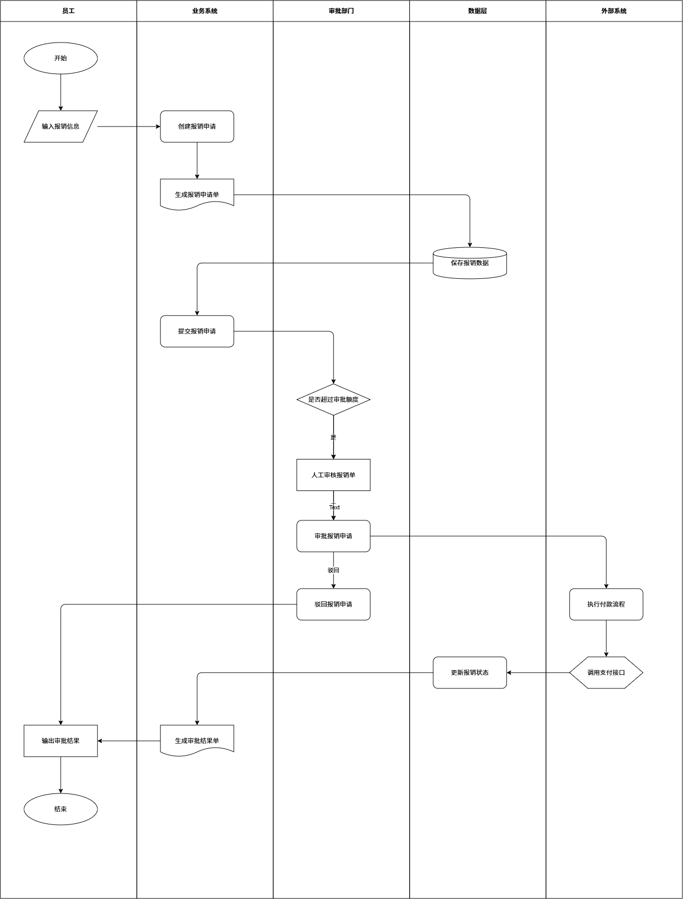

# 操作流程

1. 导入skills
2. 提供相关项目或报告
3. 获取流程图 flow.drawio
4. 将流程图 flow.drawio 导入 https://app.diagrams.net/ 即可进行观看和修改

注意：如果生成的流程图内容不充实，可向agent提供更多业务信息。

# 相关问题

生成的流程图在排版上会出现一些问题，例如部分线直接穿过无关的属性方框，这部分后面会进行进一步调控，现阶段需要人工去调整。

# 效果演示

## 图1

## 图2

## 图3 

## 图中部分线重合和出现穿透行为，这个可以暂时需要人为去调整

.png)
